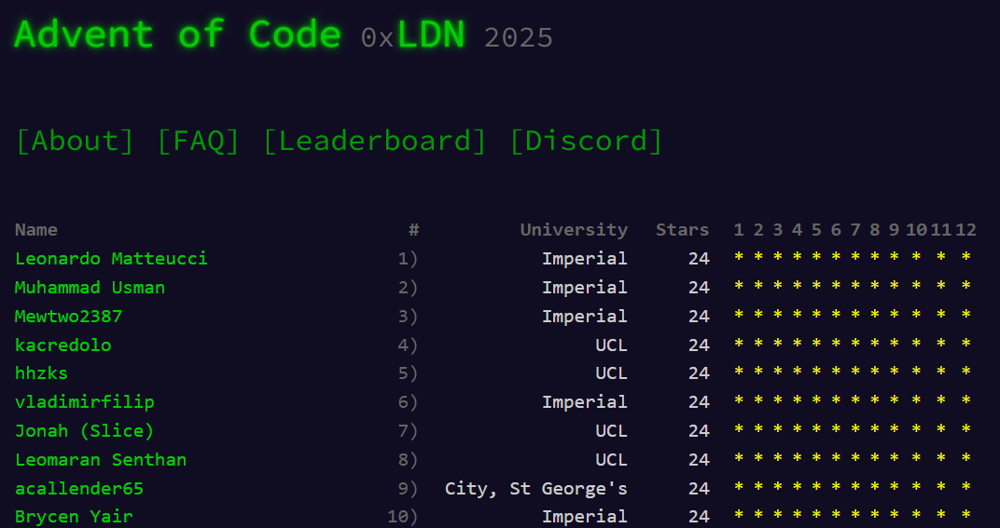
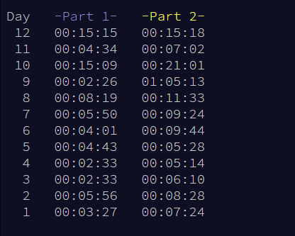
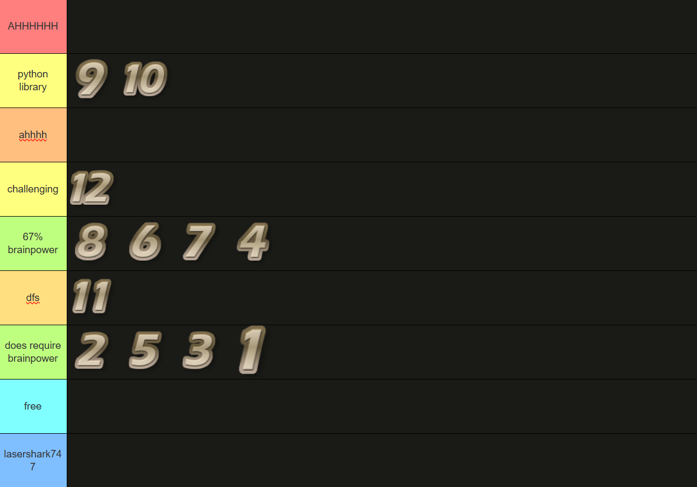
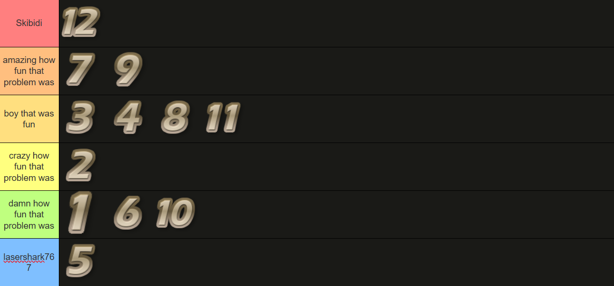

Solutions for 2025 :D\
This is by far the easiest year that I've done.\
I thought that waking up at 5am for "only" 12 days this year was a big improvement. However, I am kinda sad that the global leaderboard disappeared :(

I won the london wide uni leaderboard :)

    
Obligatory personal times below:  
  
Kinda threw on a few days, semi cooked on other days so it balances out.
  
  
## Difficulty
The early days were slightly harder than the previous years. (and the only day where I made an incorrect input was day 1 because i didn't realise there were numbers above 100 👴)\
But there was no insanely inhumanely difficult problem - I say that after using a python library to solve day 10 🤫. \
I also think like teaching union find in problem 8 was cool.\

  
### Warning: Spoilers for days 7 & 10 below.
    
## Fun!
The fun factor this year was decent. It was no spot the [christmas tree](https://adventofcode.com/2024/day/14) but like the problems were decently fun.\
I, in particular, very much enjoyed day 7 which had a cool solution involving Pascal's triangle (which i didnt use), and I didn't enjoy day 10 that much - even though I spotted the linear programming over F2 in part 1 (scars from linalg midterm) - as I ended up just sticking the whole thing in z3. I did, however, see an extremely cool [solution](https://www.reddit.com/r/adventofcode/s/h06kErDA9i) for the problem in the subreddit. I also feel like I could've had more fun doing 9 if I wasn't scrambling for time - its a fun problem I was just panicking a bit!! \
Day 12 also could have been quite interesting but the input was quite disappointing. \
  

Tierlists, as always, made with [@ZaDukk](https://github.com/ZaDukk) and [@Flameded](https://github.com/Flameded).
